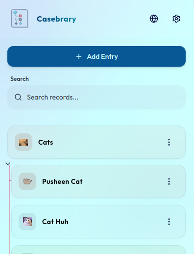
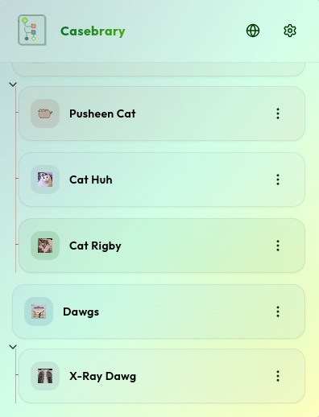
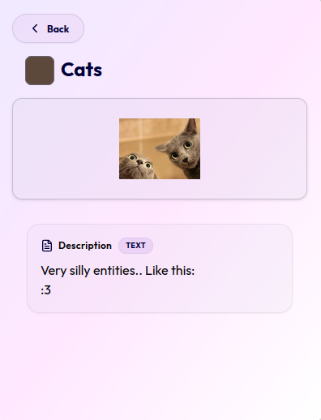
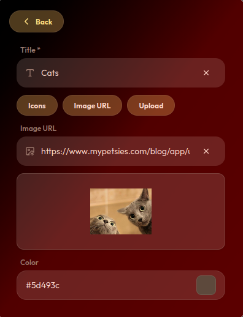
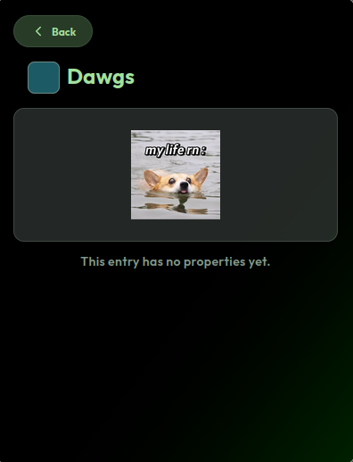
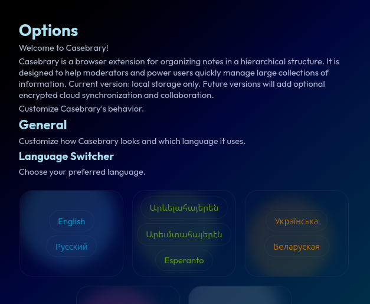
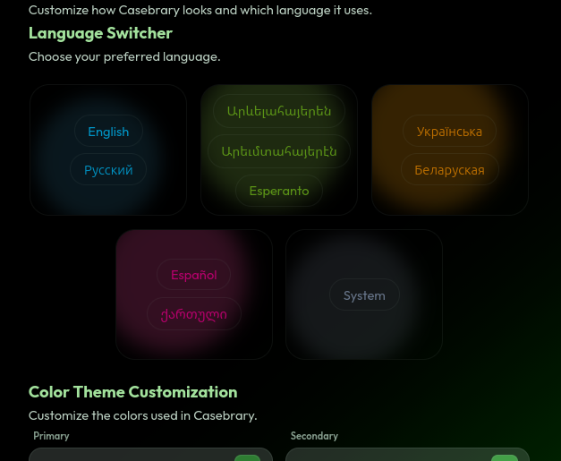
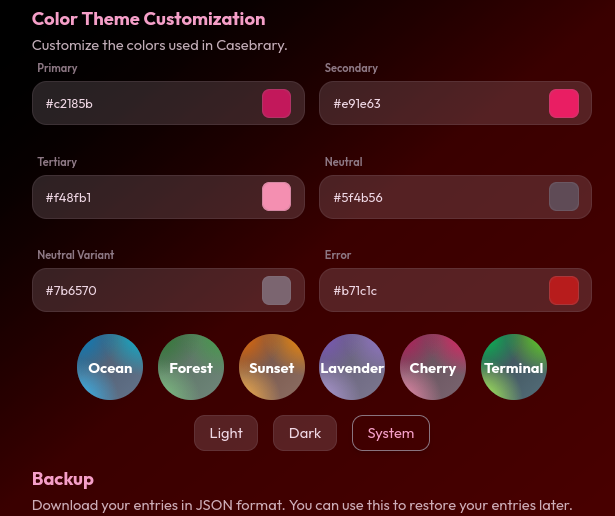

# Casebrary

> Organize information in an infinitely nested hierarchy.

Casebrary is an open-source browser extension for organizing structured information. It allows you to create hierarchical entries containing custom properties such as text, numbers, dates, images, URLs, and more.

All data is stored locally in your browser using IndexedDB. No accounts, tracking, or cloud services are required.

## Features

- 🌳 Infinite hierarchy of entries
- 🔍 Search through your entries
- 📝 Custom properties
  - Text
  - Number
  - Boolean
  - Date
  - URL
  - Image
- 🎨 Fully customizable color themes
- 🌍 Multiple interface languages
- 💾 Local IndexedDB storage
- 📤 Import and export entries as JSON
- 🔒 Privacy-friendly (all data stays on your device)

## Planned Features

- ⏰ Reminders
- 📊 Statistics and dashboards
- 📱 Multi-device synchronization
- 👥 Shared workspaces
- 🔒 Permission management
- 📸 Screenshot attachments
- ☁️ Cloud backups
- 🔔 Notifications

## Technology Stack

- React
- TypeScript
- WXT
- Redux
- IndexedDB
- Tailwind CSS
- chroma-js

## Screenshots

## Installation

See the installation instructions below for:

- Firefox
- Chrome
- Microsoft Edge

Install: https://github.com/ZeroaNinea/casebrary-build

## Credits

- UI elements: https://github.com/thesampat
- Georgian translation: https://github.com/IosebiGames
- Spanish translation: https://github.com/Ivysaur-Mrquestionmarks

## License

MIT: [LICENSE](./LICENSE)
